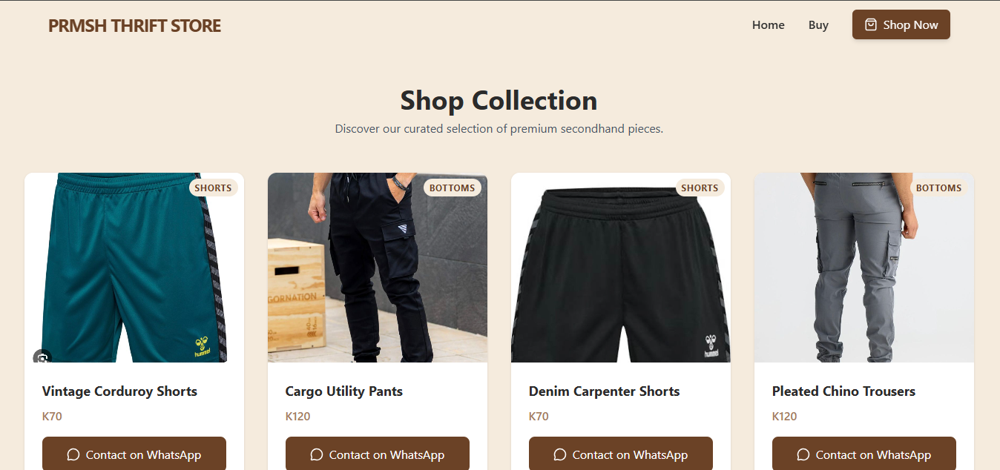
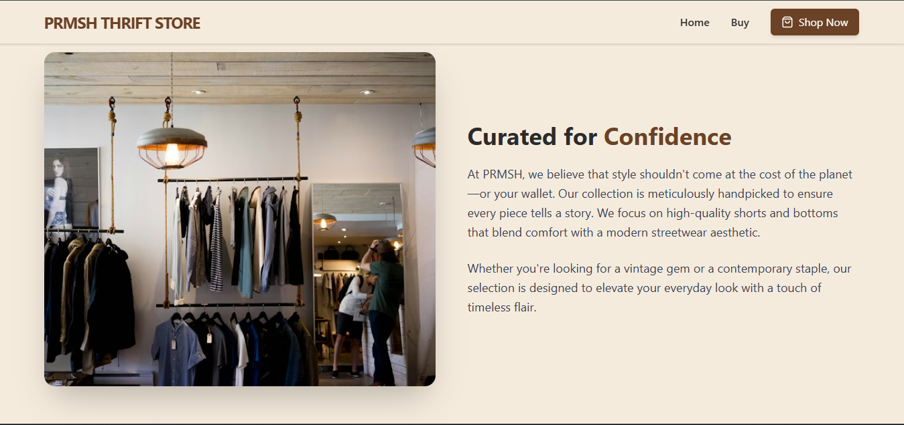

# PRMSH Thrift Store

A modern, beautifully designed thrift platform for premium clothing, specializing in shorts and bottoms. Built with React, TypeScript, and Tailwind CSS.

## 🌟 Features

- **Elegant UI/UX**: Modern, responsive design with smooth animations and transitions
- **Product Showcase**: Curated collection of premium thrift pieces with high-quality images
- **WhatsApp Integration**: Direct customer engagement through WhatsApp for inquiries and orders
- **Category Browsing**: Easy navigation between Shorts and Bottoms collections
- **Responsive Design**: Fully optimized for desktop, tablet, and mobile devices
- **Scroll Animations**: Engaging on-scroll animations for enhanced user experience
- **Hero Slider**: Eye-catching homepage with auto-rotating background images


## 📸 Demo

### Homepage


### Shop Collection


## 🛠️ Tech Stack

- **Frontend Framework**: React 18
- **Language**: TypeScript
- **Build Tool**: Vite
- **Styling**: Tailwind CSS with custom design tokens
- **Routing**: React Router DOM
- **Icons**: Lucide React & React Icons
- **State Management**: React Hooks (useState, useEffect)
- **Animations**: CSS transitions with Intersection Observer API

## 🚀 Getting Started

### Prerequisites

- Node.js (v16 or higher)
- npm or yarn

### Installation

1. Clone the repository:
```bash
git clone https://github.com/Nashiol/prmsh-thrift.git
cd prmsh-thrift
```

2. Install dependencies:
```bash
npm install
```

3. Start the development server:
```bash
npm run dev
```

4. Open your browser and navigate to `http://localhost:5173`

### Build for Production

```bash
npm run build
```

The optimized build will be generated in the `dist` folder.

## 📁 Project Structure

```
prmsh-thrift/
├── src/
│   ├── assets/
│   │   └── images/          # Product and demo images
│   ├── components/
│   │   ├── Navbar.tsx       # Navigation bar
│   │   └── Footer.tsx       # Footer with social links
│   ├── pages/
│   │   ├── home.tsx         # Homepage with hero & categories
│   │   └── buy.tsx          # Product listing page
│   ├── App.tsx              # Main app component
│   ├── main.tsx             # App entry point
│   ├── index.css            # Global styles & Tailwind config
│   └── vite-env.d.ts        # TypeScript image module declarations
├── index.html
├── tailwind.config.js       # Tailwind configuration
├── tsconfig.json            # TypeScript configuration
└── package.json
```

## 🎨 Color Palette

The project uses a carefully curated color scheme defined in Tailwind config:

- **Primary Brown**: `#6B4226` - Main brand color
- **Light Brown**: `#A67B5B` - Accent color
- **Text Dark**: `#2B2B2B` - Primary text
- **Off White**: `#F5EBDD` - Background and highlights

## 📱 Contact Integration

The platform integrates WhatsApp for direct customer communication. Update the phone number in:
- `src/pages/buy.tsx` - Product inquiry button
- `src/components/Footer.tsx` - Footer WhatsApp link

## 🔧 Customization

### Adding New Products

Edit the `products` array in `src/pages/buy.tsx`:

```typescript
{
  id: 7,
  name: 'Your Product Name',
  category: 'Shorts' | 'Bottoms',
  price: 'K150',
  image: yourImageImport
}
```

### Changing Colors

Update the color tokens in `tailwind.config.js` to match your brand.

---

**PRMSH** - Premium thrift, timeless style.
